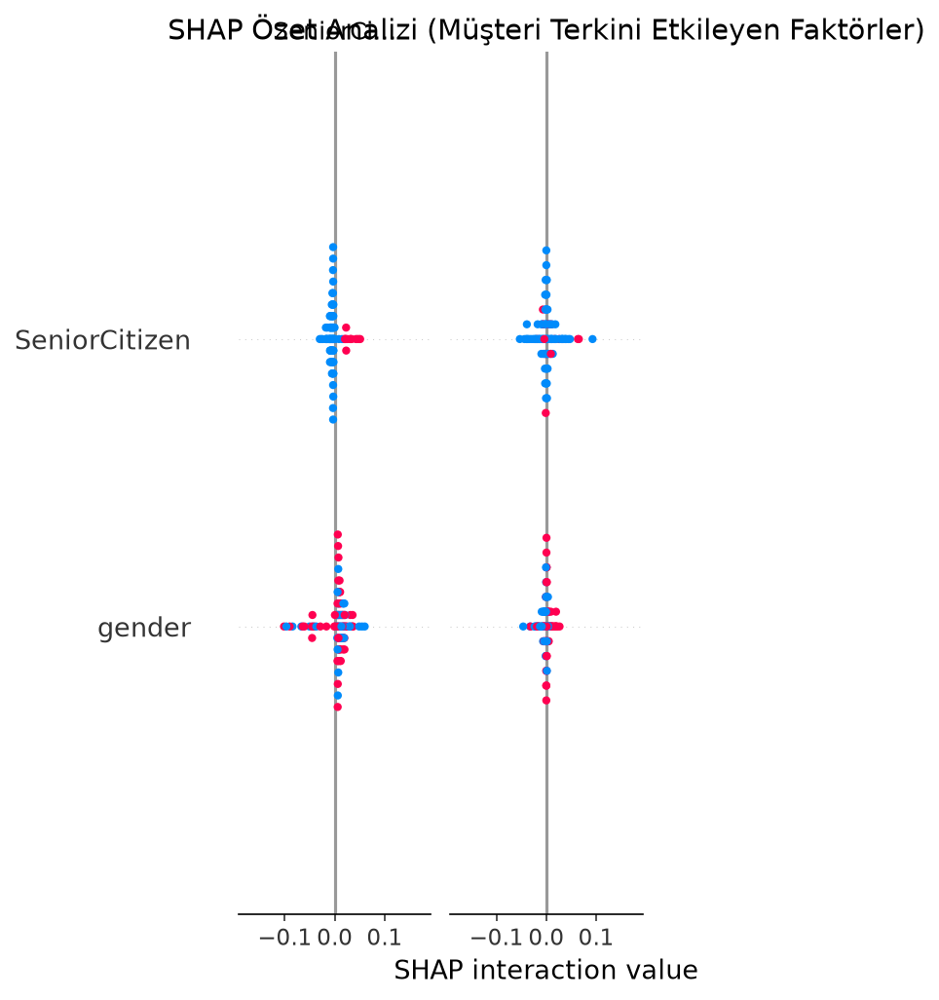

# final-projesi-umut-cerit
# Telekomünikasyon Müşteri Kaybı (Churn) Karar Destek Sistemi

## 1. Problem Tanımı
Telekomünikasyon şirketlerinde müşterilerin aboneliklerini iptal etmesi (churn) büyük bir gelir kaybı yaratmaktadır. Bu projenin amacı, müşteri davranışlarını ve demografik verilerini analiz ederek hangi müşterilerin şirketi terk etme eğiliminde olduğunu önceden tespit etmektir.

## 2. Hedef Kullanıcı
Bu sistem; müşteri ilişkileri yöneticileri, pazarlama uzmanları ve veri analistleri tarafından müşteri tutma (retention) stratejileri geliştirmek amacıyla kullanılmak üzere tasarlanmıştır.

## 3. Çözümün Kısa Açıklaması
Açık erişimli "Telco Customer Churn" veri seti kullanılarak geliştirilen bu makine öğrenmesi modeli, müşteri verilerini analiz eder ve churn riskini tahmin eder. Sadece tahmin yapmakla kalmaz, SHAP (Açıklanabilir Yapay Zeka) analizi ile bu kararın arkasındaki temel faktörleri kullanıcıya görsel olarak sunar.

## 4. Kullanılan Teknolojiler
* **Python:** Temel programlama dili
* **Pandas:** Veri temizleme ve manipülasyonu
* **Scikit-learn:** Veri ön işleme (LabelEncoder), veri bölme (train_test_split) ve modelleme (Logistic Regression, Random Forest)
* **SHAP:** Model kararlarının açıklanabilirliği (XAI)
* **Matplotlib:** Grafiksel görselleştirme

## 5. Sistem Mimarisi ve İş Akışı
1. **Veri Yükleme ve Temizleme:** Eksik verilerin silinmesi ve gereksiz sütunların (Müşteri ID) çıkarılması.
2. **Veri Ön İşleme:** Kategorik değişkenlerin sayısal verilere dönüştürülmesi.
3. **Model Eğitimi:** Verinin %80 eğitim, %20 test olarak ayrılması ve modellerin eğitilmesi.
4. **Performans Analizi:** Modellerin doğruluk oranlarının karşılaştırılması ve overfitting tespiti.
5. **Açıklanabilirlik:** SHAP kullanılarak tahmin sonuçlarının yorumlanması ve grafiğe dökülmesi.

## 6. Kurulum Adımları
Projeyi yerel ortamınızda çalıştırmak için aşağıdaki adımları izleyin:
1. Gerekli kütüphaneleri yükleyin: `pip install -r requirements.txt`

## 7. Kullanım Biçimi
Terminal veya komut satırından `app.py` dosyasını çalıştırarak sistemi başlatabilirsiniz:
`python app.py`
Çalıştırma sonrasında modellerin test ve eğitim doğruluk oranları terminalde görüntülenecek, SHAP analizi grafiği ise proje dizinine `shap_analizi.png` olarak kaydedilecektir.

## 8. Örnek Ekran Görüntüleri

*(Modelin kararlarını etkileyen en önemli özelliklerin SHAP özet grafiği)*

## 9. Test Sonuçları
* **Lojistik Regresyon Test Doğruluğu:** %78.68
* **Random Forest Test Doğruluğu:** %79.25
* **Random Forest Eğitim Doğruluğu:** %99.77 (Aşırı öğrenme / Overfitting durumu gözlemlenmiştir.)

## 10. Bilinen Sınırlılıklar
Random Forest modeli eğitim verisini ezberleme eğilimi (overfitting) göstermiştir. Bu durum modelin yeni ve daha önce görmediği veriler üzerinde hata yapma riskini artırmaktadır.

## 11. Gelecekte Yapılabilecek Geliştirmeler
* Overfitting sorununu çözmek için hiperparametre optimizasyonu (GridSearchCV veya RandomizedSearchCV) uygulanabilir.
* Model bir web arayüzüne (Streamlit veya Flask) entegre edilerek son kullanıcılar için daha etkileşimli hale getirilebilir.

## 12. Yapay Zeka Araçlarının Kullanımı
Bu projenin geliştirilme sürecinde kod hatalarının ayıklanması, kütüphane versiyon uyuşmazlıklarının çözümü ve Markdown dokümantasyonlarının taslağının oluşturulması aşamalarında Google Gemini yapay zeka asistanından destek alınmıştır.

## 13. Proje Tanıtım Videosu
[Proje Tanıtım Videosunu İzlemek İçin Tıklayın](https://www.youtube.com/watch?v=409tBIppRTc)
